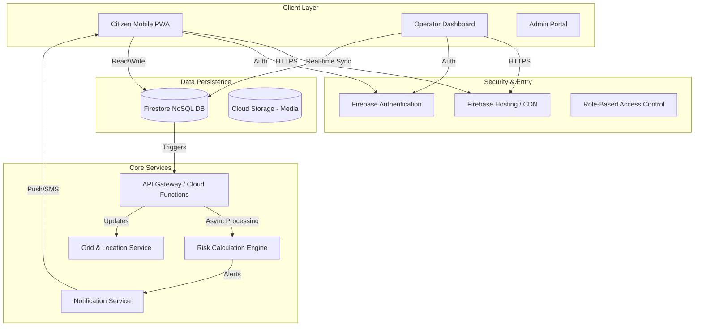
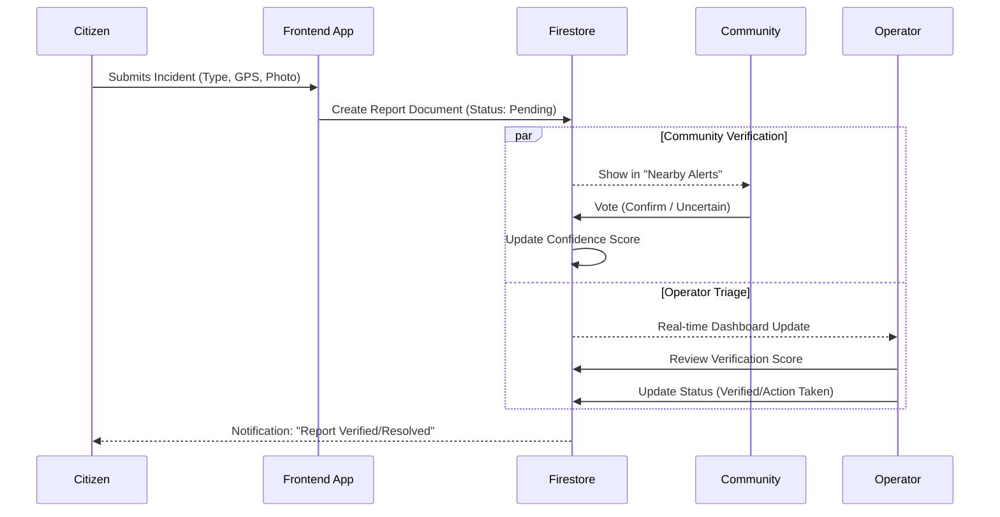
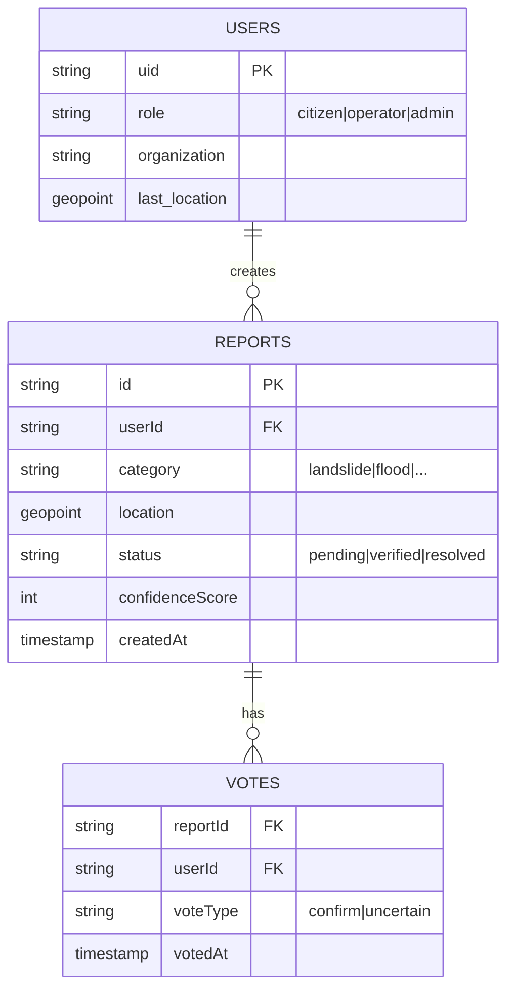

# INDRA – Intelligent National Disaster, Resource & Action Platform

> **Governance Track | Slingshot Round Submission**  
> _From Concept to Execution: A scalable, grid-based disaster management system for the Himalayas._

**Live Deployment:** [https://i-n-d-r-a.web.app/](https://i-n-d-r-a.web.app/)

---

## 📖 1. Executive Summary

INDRA is a **government-oriented decision-support platform** designed to improve disaster preparedness, response, and recovery in **Himalayan regions**. Unlike traditional reactive systems, INDRA uses a **grid-based geospatial model** (inspired by DIGIPIN) to aggregate ground-level data into actionable intelligence.

This repository contains the complete implementation plan, source code, and system design for the INDRA platform. It demonstrates how we move from a prototype to a scalable, mission-critical system capable of handling thousands of concurrent users and incidents.

### Key Capabilities

- **Citizen Reporting:** Structured incident reporting with 24+ categories (Landslides, Flash Floods, etc.).
- **Community Verification:** Crowd-sourced confidence scoring to validate reports and reduce false alarms.
- **Grid-Based Location Intelligence:** Precision mapping using GPS + State/City logic, aggregating data into 1km² - 10km² grids.
- **Operator Command Dashboard:** Real-time triage, verification, and status tracking for authorities.
- **Nearby Alerts:** Proximity-based notifications for citizens and responders.

---

## 🏗️ 2. System Architecture

INDRA is built on a **Serverless Event-Driven Architecture** to ensure high availability and automatic scaling during disaster spikes.

### Component Breakdown

1.  **Frontend Clients:** React + Vite based PWAs tailored for Citizens (mobile-first) and Operators (data-dense desktop view).
2.  **Authentication:** Secure, token-based auth with Role-Based Access Control (RBAC) ensuring strict separation between Citizen, Operator, and Admin data.
3.  **Firestore (Database):** A real-time NoSQL database chosen for its ability to push live updates to operators without polling.
4.  **Cloud Functions (Backend Logic):** Handles heavy lifting like risk score calculation, confidence aggregation, and cross-grid impact analysis.

---

## 🔄 3. Data Flow Diagrams (DFD)

### Critical Path: Incident Reporting & Verification

This flow illustrates how a report moves from a citizen's phone to an actionable verified incident on the operator's dashboard.

---

## 💾 4. Database Schema

Our schema is designed for **read-heavy** operations (millions of views) and **burst-write** scenarios (thousands of reports during a disaster).

---

## 🚀 5. Scalability & Reliability Strategy

Designing for disaster management means designing for **spikes**. Detailed below is our strategy to handle 10x to 100x traffic surges.

### 5.1 Handling Traffic Spikes (The "Burst" Problem)

- **Serverless Backend:** Using **Firebase/GCP Cloud Functions** allows the compute layer to scale from 0 to 1,000+ instances within seconds to handle incoming reports during an earthquake or flood.
- **Firestore Sharding:** Data is naturally distributed. For extreme scale, we will implement **Time-Based Partitioning** for report collections (e.g., `reports_2024_01`) to prevent hotspotting.

### 5.2 Geospatial Scalability (The "Grid" Advantage)

- **Grid Indexing:** Instead of querying "all reports within 5km radius" (which is computationally expensive), we query by **Grid IDs**.
- **O(1) Lookup:** Fetching "Risk Score for Grid X" is a direct key-value lookup, not a geospatial calculation operation. This ensures the system remains fast even with millions of reports.

### 5.3 Offline & Low Connectivity

- **PWA Cache:** The frontend is a Progressive Web App (PWA) that caches critical UI assets.
- **Background Sync:** Reports created offline are stored locally (using IndexedDB/Firestore Offline Persistence) and automatically synced when connectivity returns.

### 5.4 Failure Recovery

- **Redundancy:** Data is replicated across multiple Google Cloud zones.
- **Degraded Mode:** If the AI verification service fails, the system falls back to **manual operator verification** and raw **vote counts**, ensuring the core reporting loop never breaks.

---

## 🛠️ 6. Tech Stack & Implementation Details

| Component    | Technology                  | Reasoning                                                      |
| :----------- | :-------------------------- | :------------------------------------------------------------- |
| **Frontend** | React, Vite, Tailwind CSS   | High performance, rapid iteration, small bundle size.          |
| **Auth**     | Firebase Auth               | Secure identity handling, supports email/Google/Phone.         |
| **Database** | Cloud Firestore             | Real-time listeners for operator dashboards, seamless scaling. |
| **Location** | Geolocation API + Nominatim | Precise coordinates mapped to administrative boundaries.       |
| **Icons**    | Lucide React                | Clean, intuitive visual language for stressful situations.     |

---

## 🔮 7. Future Roadmap (Post-Slingshot)

1.  **AI Image Analysis:** Auto-detect severity from uploaded photos (e.g., distinguishing a minor crack from a collapsed bridge).
2.  **IoT Integration:** Ingest data from river level sensors and seismic monitors directly into the grid risk model.
3.  **Offline-First Mesh:** Peer-to-peer report sharing via Bluetooth/Wi-Fi Direct for completely disconnected zones.

---

### 👥 Contributors

- **Team INDRA** - _Build for the Himalayas, Build for Resilience._
